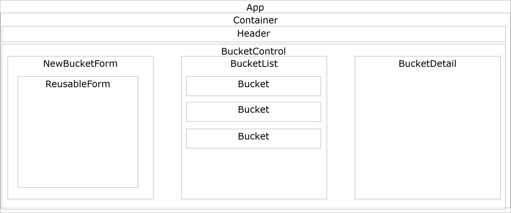

# Ice Cream Parlor

#### By **Samantha Callie**

#### List buckets of ice cream

## Technologies Used

* HTML
* CSS
* JS
* draw.io
* See dependencies in [package.json](package.json)

## Description

This site allows users to create, read, update and delete buckets of different ice cream flavors on a list. These flavors have a name, description, and vegan status, and scoops left. The scoops can be reduced with the `Buy` button, and the bucket can be removed by the `Remove Bucket`.

## Component Diagram

## Setup/Installation Requirements

1. Press the green <> Code button and select Download ZIP
2. Unzip file
3. In the top directory, open your terminal (e.g., Terminal or GitBash) and run the command `npm i` (requires npm)
3. Then run one of the scripts below

## Available Scripts

In the project directory, you can run:

### `npm run start`

Runs the app in the development mode.
Open [http://localhost:3000](http://localhost:3000) to view it in your browser.

### `npm run build`

Builds the app for production to the `build` folder.
It correctly bundles React in production mode and optimizes the build for the best performance..

## Known Bugs

* There are no known bugs at this time

## License

Copyright (c) 2025 Samantha Callie

[GNU](LICENSE)